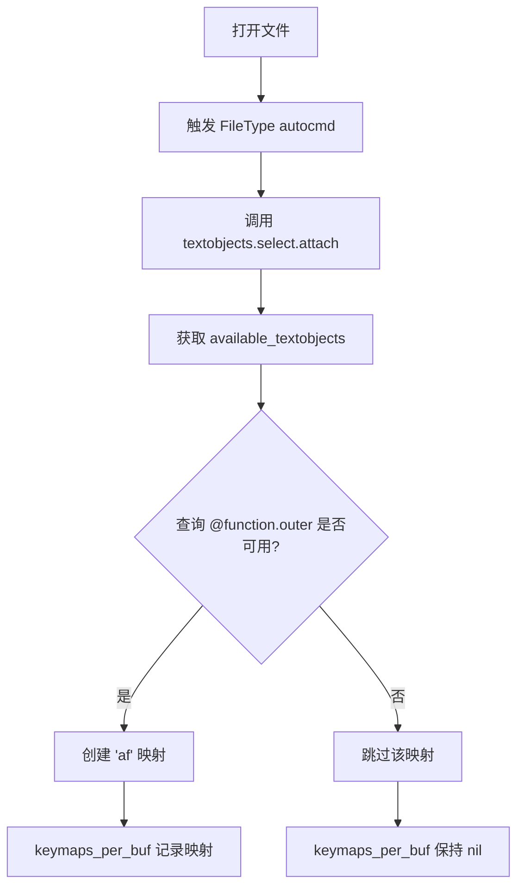

# Neovim Treesitter Textobjects 失效问题分析

## 问题描述

在 Python、TypeScript、JavaScript 等文件中，textobjects 按键映射（如 `vaf`、`yif` 等）完全失效，只会进入 Visual 模式但不选中任何内容。然而在 Lua 文件中功能正常。

## 症状表现

- ✅ 在 `.lua` 文件中：`vaf` 能正确选中整个函数
- ❌ 在 `.py`、`.ts`、`.js` 文件中：`vaf` 只进入 visual 模式，无法选中函数
- ✅ 插件状态正常：`:Lazy` 显示 `nvim-treesitter` 和 `nvim-treesitter-textobjects` 都已加载
- ✅ 模块配置正确：`:lua print(vim.inspect(require('nvim-treesitter.configs').get_module('textobjects.select')))` 显示 `enable = true`，配置完整
- ❌ 映射缺失：`:map af` 在 Python/TypeScript 文件中返回 "No mapping found"

## 排查过程

### 1. 初步检查（正常）
- Parser 已安装：`has_parser('python')` 返回 `true`
- 查询文件存在：`~/.local/share/nvim/lazy/nvim-treesitter-textobjects/queries/python/textobjects.scm` 包含完整的 function、class、loop 等定义
- 模块已启用：`textobjects.select.enable = true`

### 2. 深入排查（发现关键线索）
```vim
:lua print(vim.inspect(require('nvim-treesitter.configs').get_module('textobjects.select').keymaps_per_buf))
```
**结果：`nil`** ← 说明 `attach` 函数从未在该 buffer 上执行

### 3. 测试可用的 textobjects
```vim
:lua print(vim.inspect(require('nvim-treesitter.textobjects.shared').available_textobjects('python', 'textobjects')))
```
**结果：`{ "exception.outer", "exception.inner" }`** 

**预期：应该包含 `function.outer`、`function.inner`、`class.outer` 等多个 textobjects**

## 根本原因

### 🔴 查询文件被覆盖

用户配置目录下存在自定义查询文件：

```
~/.config/nvim/queries/
├── python/textobjects.scm       (只定义了 exception，10 行)
├── ecma/textobjects.scm         (只定义了 exception，12 行)
├── cpp/textobjects.scm          (只定义了 exception，13 行)
└── java/textobjects.scm         (只定义了 exception)
```

这些文件**完全替换**了插件自带的查询文件（Python 插件自带 200+ 行），导致：

- ❌ `function.outer`、`function.inner` 等标准 textobjects 定义丢失
- ❌ `attach` 函数检查 `available_textobjects` 时发现 `@function.outer` 不可用
- ❌ 映射不会被创建（`keymaps_per_buf` 保持 `nil`）
- ✅ 只有 `exception.outer`、`exception.inner` 可用

### 为什么 Lua 文件能工作？

因为 `~/.config/nvim/queries/` 目录下**没有 `lua/textobjects.scm`**，所以 Lua 文件使用的是插件自带的完整查询定义。

## 解决方案

### 问题文件的正确写法

Neovim 的查询系统支持两种模式：

#### ❌ 错误：默认会**替换**插件查询
```scheme
;; 这会完全覆盖插件的查询
(try_statement) @exception.outer
```

#### ✅ 正确：使用 `;; extends` **追加**到插件查询
```scheme
;; extends

;; 这会追加到插件的查询，保留所有标准 textobjects
(try_statement) @exception.outer
```

### 实施的修复

1. **Python** (`queries/python/textobjects.scm`)：
```scheme
;; extends

;; Exception handling queries for Python
(try_statement) @exception.outer
(try_statement
  body: (block) @exception.inner)
```

2. **JavaScript/TypeScript** (`queries/ecma/textobjects.scm`)：
```scheme
;; extends

;; Exception handling queries for JavaScript/TypeScript
(try_statement) @exception.outer
(try_statement
  body: (statement_block) @exception.inner)
```

3. **JavaScript** (`queries/javascript/textobjects.scm`)：
```scheme
;; inherits: ecma
```

4. **TypeScript** (`queries/typescript/textobjects.scm`)：
```scheme
;; inherits: ecma
```

5. **Go** (`queries/go/textobjects.scm`)：
```scheme
;; extends

;; Go uses defer for error handling (no try-catch)
(defer_statement) @exception.outer
(defer_statement
  (call_expression) @exception.inner)
```

## 关键知识点

### Neovim 查询文件优先级

```
用户配置 > 插件提供
~/.config/nvim/queries/python/textobjects.scm  (优先级高)
~/.local/share/nvim/lazy/nvim-treesitter-textobjects/queries/python/textobjects.scm  (被覆盖)
```

### 查询文件指令

| 指令 | 作用 | 使用场景 |
|------|------|----------|
| `;; extends` | 追加到父查询（通常是插件的查询） | 添加自定义 textobjects，保留标准功能 |
| `;; inherits: <lang>` | 继承另一个语言的查询 | JS/TS 继承 ecma，避免重复定义 |
| 无指令 | 完全替换插件查询 | 完全自定义实现（不推荐） |

### Textobjects Attach 流程



## 附加修复

除了查询文件问题，还修复了插件初始化问题：

### 在 `lua/plugins.lua` 中添加：

```lua
config = function()
  -- 初始化 textobjects 插件（必须在 setup 之前）
  require("nvim-treesitter-textobjects").init()
  
  require("nvim-treesitter.configs").setup(require("plugin-config.nvim-treesitter"))
  
  -- 确保 textobjects 在所有 buffer 上 attach
  vim.api.nvim_create_autocmd({"FileType"}, {
    pattern = "*",
    callback = function(args)
      local bufnr = args.buf
      local ft = vim.bo[bufnr].filetype
      
      if ft and ft ~= "" then
        local select_mod = require('nvim-treesitter.textobjects.select')
        local move_mod = require('nvim-treesitter.textobjects.move')
        
        vim.schedule(function()
          if vim.api.nvim_buf_is_valid(bufnr) then
            pcall(select_mod.attach, bufnr)
            pcall(move_mod.attach, bufnr)
          end
        end)
      end
    end,
  })
end,
```

## 验证修复

重启 Neovim 后，在 Python 文件中执行：

```vim
" 检查可用的 textobjects（应该看到完整列表）
:lua print(vim.inspect(require('nvim-treesitter.textobjects.shared').available_textobjects('python', 'textobjects')))

" 应该输出：
" { "function.outer", "function.inner", "class.outer", "class.inner", 
"   "loop.outer", "loop.inner", "conditional.outer", "conditional.inner",
"   "parameter.outer", "parameter.inner", "comment.outer", "exception.outer", "exception.inner", ... }

" 检查映射是否创建
:map af
" 应该显示：
" x  af  * @<Cmd>lua require'nvim-treesitter.textobjects.select'.select_textobject(...)
```

## 总结

这是一个典型的**配置文件优先级**导致的问题：

1. 用户创建了自定义查询文件（可能是为了添加 exception textobjects）
2. 忘记添加 `;; extends` 指令
3. 导致插件的标准查询被完全覆盖
4. `available_textobjects` 只返回自定义的 exception
5. `attach` 函数跳过了不可用的 textobjects（如 function）
6. 映射从未被创建

**教训**：在用户配置目录创建 treesitter 查询文件时，**务必使用 `;; extends` 来追加而不是替换**！

